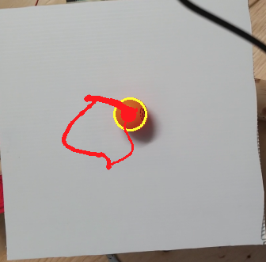

# opencv_ball_tracking

Balancing a Ping Pong ball with Arduino and OpenCV

1. Colour picker to generate HSV values to be used in OpenCV
2. Object tracking using generated image masking/contouring to pinpoint ball
3. Position and acceleration history stored for processing
4. Feedback loop control schema to adjust ball position
3. Serial communication with Arduino Uno for real-time servo movement
4. Graphical output of time-response characteristics for control tuning

